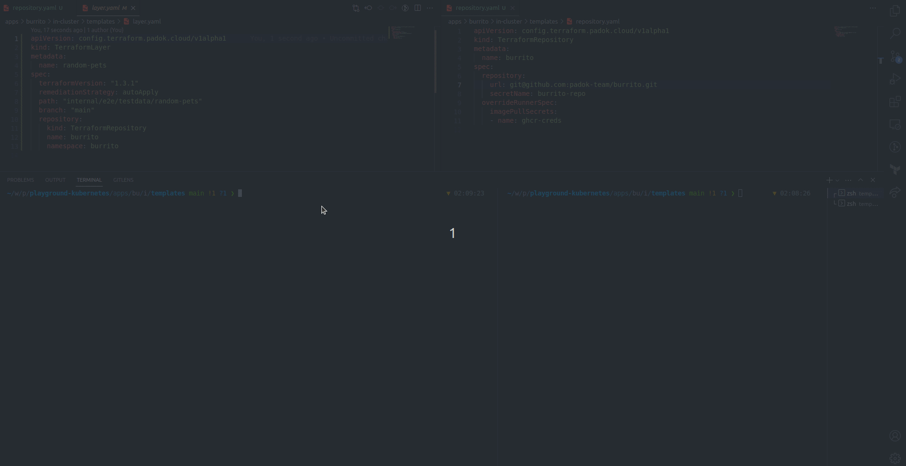

> [!WARNING]
> This project is still in a pre-release state, minor versions will introduce breaking changes until 1.0
> 
> You should only use releases, as the main branch can be broken.

# burrito <!-- omit in toc -->

**Burrito** is a TACoS (**T**erraform **A**utomation **Co**llaboration **S**oftware) Kubernetes Operator.

## Why does this exist?

[`terraform`](https://www.terraform.io/) is a tremendous tool to manage your infrastructure in IaC.
However, it lacks built-in solutions for managing [state drift](https://developer.hashicorp.com/terraform/tutorials/state/resource-drift).

Additionally, configuring a CI/CD pipeline for Terraform can be challenging and often varies depending on the selected tools.

Finally, currently, there is no easy way to navigate your Terraform state to truly understand the modifications it undergoes when running `terraform apply`.

`burrito` aims to tackle those issues by:

- Planning continuously your Terraform code and running applies if needed
- Offering an out-of-the-box PR/MR integration so you do not have to write CI/CD pipelines for Terraform ever again
- Showing your state's modifications in a simple Web UI

## Demo

## Documentation

To learn more about burrito [go to the complete documentation](https://docs.burrito.tf).

## Community

### Contribution, Discussion and Support

Please read our [Contribution Guide](https://docs.burrito.tf/contributing/) for more information on how to get involved.

Current maintainers:

- [@corrieriluca](https://github.com/corrieriluca)
- [@LucasMrqes](https://github.com/LucasMrqes)

Former maintainers:

- [@spoukke](https://x.com/spoukke)
- [@LonguetAlan](https://x.com/LonguetAlan)

### Blogs and Presentations

1. [Our burrito is a TACoS](https://cloud.theodo.com/en/blog/burrito-tacos)
2. [What challenges did we solve with Burrito?](https://cloud.theodo.com/en/blog/what-challenges-did-we-solve-with-burrito)

## License

© 2025 [Theodo Cloud](https://cloud.theodo.com/en/)

Licensed under the [Apache License](https://www.apache.org/licenses/LICENSE-2.0), Version 2.0 ([LICENSE](./LICENSE))
