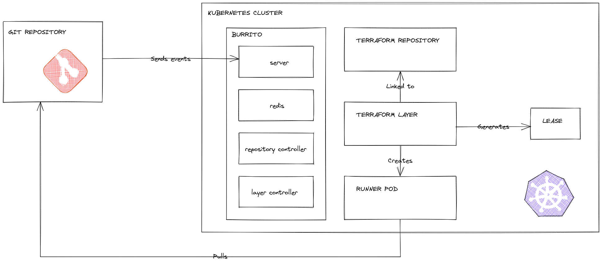

# Design <!-- omit in toc -->

## Architectural Overview

## Components

### The erver

The server is a REST server which exposes the API consumed by the Web UI. It has the following responsibilities:
- listener for Git webhook events

Othter functionnalities will be implemented when the Web UI will be developped.

### The repository Controller

The repository controller is a Kubernetes Controller which is only used to resgister `TerraformRepository` ressources.

### The layer Controller

The layer controller is a Kubernetes Controller which continuously monitors declared `TerraformLayer` ressources.
It regurlarly start runner pods which runs a `terraform plan` for each of your layer to check if a drift has been introduced.
If so, it has the possibility to run a `terraform apply`.

It also is responsible for running your terraform `plan` and `apply` if there a new commit on your layer.

It also generates [`Leases`](https://kubernetes.io/docs/concepts/architecture/leases/) to make sure no concurrent terraform commands will be launched on the same layer at the same time.

### The redis instance

The redis instance is used to store the binary generated by `terraform plan` before running the `apply`.

## Implementation

The operator has been bootstrapped using the [`operator-sdk`](https://sdk.operatorframework.io/).

The CLI used to start the different components is implemented using [`cobra`](https://github.com/spf13/cobra).

### The layer Controller

The status of a `TerraformLayer` is defined using the [conditions standards defined by the community](https://github.com/kubernetes/community/blob/master/contributors/devel/sig-architecture/api-conventions.md#typical-status-properties).

3 conditions are defined for a layer:
- `IsPlanArtifactUpToDate`. This condition is used for drift detection. The evaluation is made by compraing the timestamp of the last `terraform plan` which ran and the current date. The timestamp of the last plan is "stored" using an annotation.
- `IsApplyUpToDate`. This condition is used to check if an `apply` needs to run after the last `plan`. Comparison is made by comparing a checksum of the last planned binary and a checksum last applied binary stored in the annotations.
- `IsLastConcerningCommitPlanned`. This condition is used to check if a new commit has been made to the layer and need to be applied. It is evaluated by comparing the commit used for the last `plan`, the last commit which intoduced changes to the layer and the last commit made to the same branch of the repository. Those commits are "stored" as annotations.

> N.B. We use annotations to store information because we do not want to rely to heavily on the uptime of the redis instance.

With those 3 conditions, we defined 3 states:
- `IdleState`. This is the state of a layer if no runner needs be started
- `PlanNeededState`. This is the state of a layer if burrito needs to start a `plan` runner
- `ApplyNeededState`. This is the state of a layer if burrito needs to start an `apply` runner

> N.B. If you use [`dry` remediation strategy](../../../README.md#choose-your-remediation-strategy) and an apply is needed, the layer will stay in the `ApplyNeededState` as long as it does not need to enter the `PlanNeededState`.

The layer controller also generates the Kubernetes leases to avoid concurrent use of terraform on the same layer.

> N.B. We use lease objects in order to not have to rely on the redis instance for layer locking.

The layer controller is also responsible for registering runner pods to the Kubernetes API. We decided to use dynamic runners in order to be able to associate specific service accounts for each layers (each layer does not need the same access right to be planned and applied).

### The runners

The runner image implementation heavily relies on golang libraries provided by hashicorp such as `tfexec`, `releases` and `product` which allows us to dynamically download and use any version of therraform binary.
Thus, we support any existing version of terraform.
