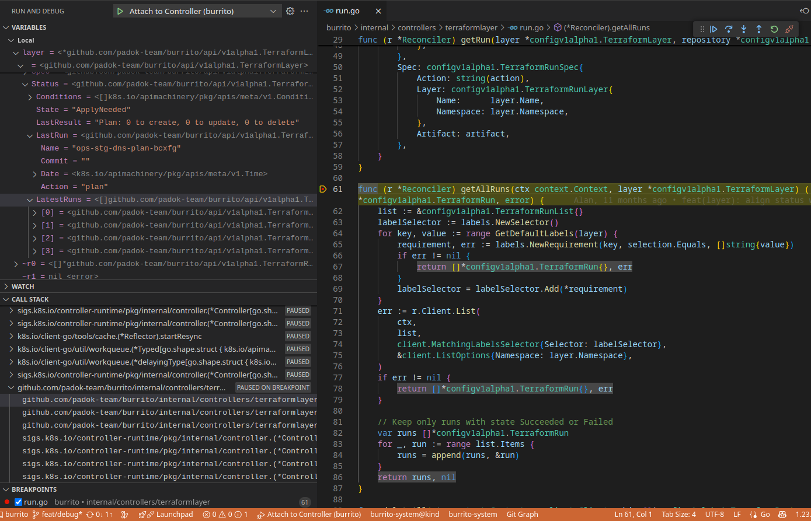

# Contributing

First off, thank you for considering contributing to Burrito! Your support helps make this project better for everyone.

The following is a set of tutorials and guidelines for contributing to Burrito. These are mostly guidelines, not rules. Use your best judgment, and feel free to propose changes to this document.

## How Can I Contribute?

### Reporting Bugs

If you find a bug, please report it by opening an issue on the issue tracker. Before reporting, please check whether the issue has already been reported.

- Ensure the bug hasn't been reported yet.
- Use a clear and descriptive title.
- Provide detailed steps to reproduce the issue.
- Include any relevant logs or screenshots.

### Suggesting Enhancements

We welcome suggestions for improvements. Please use the issue tracker to submit enhancement requests.

- Use a clear and descriptive title.
- Explain why this enhancement would be useful.
- Provide examples or mockups if possible.

### Contributing Code

- Set up a development environment following the steps below.
- Read the Development Guidelines.
- Submit contributions!

## Getting Started: Set Up a Local Development Environment (kind)

### Prerequisites

- A container runtime (docker, podman, etc.)
- Git
- [Kind](https://kind.sigs.k8s.io/)
- [Helm](https://helm.sh/)
- [`kubectl`](https://kubernetes.io/docs/tasks/tools/#kubectl)
- [`yq`](https://github.com/mikefarah/yq)
- `make`

To run an instance of Burrito, you will need a Kubernetes cluster. This tutorial uses Kind as a local development Kubernetes cluster.

Follow [Kind's quick start tutorial](https://kind.sigs.k8s.io/docs/user/quick-start) to set up a local cluster.

Once your cluster is up and running, follow the next steps to compile and deploy Burrito.

### Basic Install

Follow these steps to install a minimal working configuration of Burrito on a Kind cluster:

- Cert-manager
- Burrito controllers in the `burrito-system` namespace
- A datastore running with mock storage (in-memory)
- A `TerraformRepository` and an associated `TerraformLayer` resource in the `burrito-project` namespace, pointing to the [padok-team/burrito-examples](https://github.com/padok-team/burrito-examples) repository

*Before starting, check that your local Kind cluster is running and that your context is set to target this cluster.*

1. **Install cert-manager on your cluster:**

    ```bash
    helm repo add bitnami https://charts.bitnami.com/bitnami
    helm upgrade --install -n cert-manager --create-namespace cert-manager bitnami/cert-manager --set installCRDs=true
    ```

2. **Fork and clone this repository.**

3. **Run the following command to build a local image of Burrito, load it into your Kind cluster, and install Burrito with development Helm values:**

    ```bash
    make upgrade-dev-kind
    ```

4. **Check that Burrito is running in the `burrito-system` namespace:**

    ```bash
    kubectl get pods -n burrito-system
    ```

    The output should be similar to:

    ```bash
    NAME                                  READY   STATUS    RESTARTS   AGE
    burrito-controllers-7657b7455-2ldtd   1/1     Running   0          5m32s
    burrito-datastore-5967f46497-tfzgg    1/1     Running   0          5m32s
    burrito-server-5b6fb78949-ngcnt       1/1     Running   0          5m32s
    ```

5. **Create layers and repository resources:**

    Create a `dev` directory in `deploy/charts/burrito/templates/` and add a `dev.yaml` manifest with development resources:

    ```yaml
    apiVersion: config.terraform.padok.cloud/v1alpha1
    kind: TerraformLayer
    metadata:
        name: my-layer
        namespace: burrito-project
    spec:
        branch: main
        path: terraform/
        repository:
            name: my-repository
            namespace: burrito-project
    ---
    apiVersion: config.terraform.padok.cloud/v1alpha1
    kind: TerraformRepository
    metadata:
        name: my-repository
        namespace: burrito-project
    spec:
        repository:
            url: https://github.com/padok-team/burrito-examples
        remediationStrategy:
            autoApply: true
        terraform:
            enabled: true
        opentofu:
            enabled: false
        terragrunt:
            enabled: false
    ```

6. **Refresh your Helm configuration:**

    ```bash
    make upgrade-dev-helm
    ```

7. **Check that a runner pod is created for the newly created layer:**

    ```bash
    kubectl get pods -n burrito-project
    ```

    The output should be similar to:

    ```text
    NAME                   READY   STATUS      RESTARTS   AGE
    my-layer-apply-gxjhd   0/1     Completed   0          2m36s
    ```

### Refresh Commands

To build a new local image of Burrito, push it into your local Kind cluster, and update the Helm release with the new image tag, run the following:

```bash
make upgrade-dev-kind
```

To refresh the Helm chart with development values, run:

```bash
make upgrade-dev-helm
```

Check the [Makefile](https://github.com/padok-team/burrito/blob/main/Makefile) for more details about these commands.

### Advanced Settings

**Configure a GitHub Token for TENV:**

It is strongly recommended to create a GitHub token with no specific rights to bypass the GitHub API rate limiting. Append the following configuration to your development `TerraformRepository` resources:

```yaml
  overrideRunnerSpec:
    env:
      - name: TENV_GITHUB_TOKEN
        value: ghp_xxxxx
```

## Development Guidelines

### Testing

- Write tests for new features or bug fixes.
- Run all tests to ensure existing functionality isn't broken (`make test`).
- Ensure code coverage remains at the same level or higher.

### Commit Messages

- Please follow the convention described by [Conventional Commits](https://www.conventionalcommits.org/en/v1.0.0/).
- If you don't, the CI pipeline will fail.

## Additional Resources

- [Controller-runtime documentation](https://pkg.go.dev/sigs.k8s.io/controller-runtime) (Burrito heavily relies on this package)
- [Burrito documentation](https://docs.burrito.tf/)

## Debugging Burrito

To debug Burrito efficiently in Kubernetes, you can use [Delve](https://github.com/go-delve/delve), optionally with [Visual Studio Code](https://code.visualstudio.com/) (recommended). We have set a few things to help you getting started.

You'll need to follow instructions in [Getting Started: Set Up a Local Development Environment (kind)](#getting-started-set-up-a-local-development-environment-kind) to get a local Kubernetes development instance.

### Enable debugging

First, being by installing dlv: `go install github.com/go-delve/delve/cmd/dlv@latest`

We'll rely on `deploy/charts/burrito/values-debug.yaml` to deploy the configuration to start the debugging session.

By default, the different component debug configs are commented in the Helm values. Indeed, starting the application with dlv server will hang until you connect with the dlv client so it has to be enabled only when you need it.

```yaml
# config:
#   burrito:
#     runner:
#       command: ["/usr/local/bin/dlv"]
#       args: ["--listen=0.0.0.0:2346", "--headless=true", "--accept-multiclient", "--api-version=2", "--log", "exec", "/usr/local/bin/burrito", "runner", "start"]

# controllers:
#   deployment:
#     mode: Debug
#     command: ["/usr/local/bin/dlv"]
#     args: ["--listen=0.0.0.0:2345", "--headless=true", "--accept-multiclient", "--api-version=2", "--log", "exec", "/usr/local/bin/burrito", "controllers", "start"]

# datastore:
#   deployment:
#     mode: Debug
#     command: ["/usr/local/bin/dlv"]
#     args: ["--listen=0.0.0.0:2347", "--headless=true", "--accept-multiclient", "--api-version=2", "--log", "exec", "/usr/local/bin/burrito", "datastore", "start"]

# server:
#   deployment:
#     mode: Debug
#     command: ["/usr/local/bin/dlv"]
#     args: ["--listen=0.0.0.0:2348", "--headless=true", "--accept-multiclient", "--api-version=2", "--log", "exec", "/usr/local/bin/burrito", "server", "start"]
```

!!! note
    The runner command+args override isn't under `runner.deployment` as other components as it's not a k8s deployment

!!! tip
    You can also launch burrito with the debug build and override command+args in `overrideRunnerSpec` in a specific layer you'd like to debug.

By default, we'll start the application with the usual command. If you want to debug the controller or the runner, uncomment the required block. This will open a port on the pod on which you'll connect from your computer.

`mode: Debug` is removing liveness and readiness probes: they won't be able to start as dlv will await for you to start the debugging session.

### Deploy/refresh commands

You'll need to deploy the debug container images and config. This is the same command if you need to refresh your deployment.

To build a new local debug image of Burrito, push it into your local Kind cluster, and update the Helm release with the new image tag, run the following:

```bash
make upgrade-debug-kind
```

To refresh the Helm chart with debug values, run:

```bash
make upgrade-debug-helm
```

Check the [Makefile](https://github.com/padok-team/burrito/blob/main/Makefile) for more details about these commands.

### Connect from your computer to the debug session

The debugging port won't be exposed by default so you'll need to port-forward it.

- For the controller:

```bash
kubectl port-forward $(kubectl get pods -n burrito-system | awk '/burrito-controllers.*Running/{print $1}') -n burrito-system 2345:2345
```

- For the runner:

```bash
kubectl port-forward -n burrito-project <layerName> 2346:2346
```

It will listen on the same port than the controller so we're exposing it on port 2346 on your computer so you can debug the controller and the runner if needed.

- For the datastore:

```bash
kubectl port-forward $(kubectl get pods -n burrito-system | awk '/burrito-datastore.*Running/{print $1}') -n burrito-system 2347:2347
```

- For the server:

```bash
kubectl port-forward $(kubectl get pods -n burrito-system | awk '/burrito-server.*Running/{print $1}') -n burrito-system 2348:2348
```

### Start debugging

#### With vscode

!!! note
    You can get more information about Vscode+Go debugging [here](https://github.com/golang/vscode-go/blob/master/docs/debugging.md)

If you want to use Vscode to debug the app, you'll need to get the [Go extension](https://marketplace.visualstudio.com/items?itemName=golang.go) and create a `.vscode/launch.json`:

```json
{
    "version": "0.2.0",
    "configurations": [
        {
            "name": "Attach to Controller",
            "type": "go",
            "request": "attach",
            "mode": "remote",
            "port": 2345,
            "host": "127.0.0.1",
            "apiVersion": 2
        },
        {
            "name": "Attach to Runner",
            "type": "go",
            "request": "attach",
            "mode": "remote",
            "port": 2346,
            "host": "127.0.0.1",
            "apiVersion": 2
        },
        {
            "name": "Attach to Datastore",
            "type": "go",
            "request": "attach",
            "mode": "remote",
            "port": 2347,
            "host": "127.0.0.1",
            "apiVersion": 2
        },
        {
            "name": "Attach to Server",
            "type": "go",
            "request": "attach",
            "mode": "remote",
            "port": 2348,
            "host": "127.0.0.1",
            "apiVersion": 2
        }
    ]
}
```

!!! question "New to debugging on Vscode?"
    For a vscode debug introduction, you can check [Debug code with Visual Studio Code](https://code.visualstudio.com/docs/debugtest/debugging).

Browse your code to set breakpoints by clicking on the left side of your line.


Open the `Run and Debug` pane, select your debugging configuration and hit `F5` to connect to the remove `dlv`.


Once your line is reached, vscode will show you the variables, current stack, etc



#### With `dlv`

If you prefer to debug on cli, you can connect with `dlv connect 127.0.0.1:<debuggingPort>` where `<debuggingPort>` is 2345, 2346, 2347 or 2348, depending on what you're debugging.
