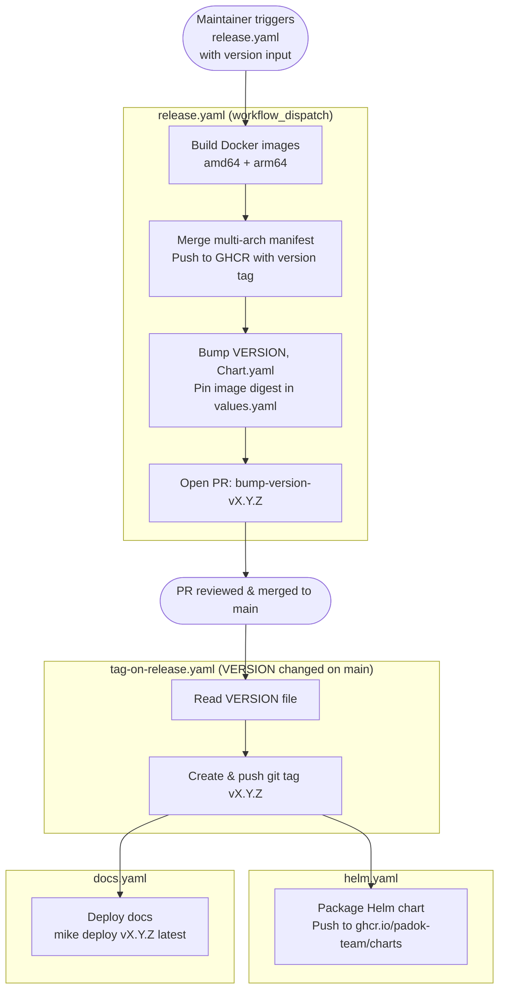

# CI/CD & Release Process

This page describes the GitHub Actions workflows that power Burrito's CI/CD pipeline and explains the step-by-step release process.

## Workflows Overview

| Workflow | Trigger | Purpose |
|---|---|---|
| `ci.yaml` | Push / PR on `main` | Run Go unit & integration tests |
| `ci-frontend.yaml` | Push / PR on `main` | Lint and build the UI |
| `conventional-commits.yaml` | PR on `main` | Enforce Conventional Commits format |
| `build-and-push.yaml` | Reusable (called by others) | Build multi-arch Docker images and push to GHCR |
| `release.yaml` | `workflow_dispatch` | Orchestrate a full release |
| `tag-on-release.yaml` | Push to `main` (VERSION changed) | Create git tag, push Helm chart, deploy docs |
| `helm.yaml` | Reusable (called by others) | Package and push the Helm chart to GHCR |
| `docs.yaml` | Reusable (called by others) | Deploy documentation with `mike` |
| `trivy.yaml` | Scheduled / push | Container image vulnerability scanning |

## Release Process

Releases are triggered **manually** via the `release.yaml` workflow with a version string (e.g. `v1.2.3`) as input.

### Step-by-step

1. **Trigger** — A maintainer runs the `release` workflow from GitHub Actions, providing the target version (must follow [SemVer](https://semver.org/), prefixed with `v`).

2. **Build Docker images** — The `build-and-push.yaml` reusable workflow builds platform-specific images for `linux/amd64` and `linux/arm64` in parallel, then merges them into a single multi-arch manifest pushed to `ghcr.io/padok-team/burrito:<version>`.

3. **Version bump PR** — Once the images are published, the release workflow:
    - Updates the `VERSION` file with the new version.
    - Updates `Chart.yaml` (`version` and `appVersion`).
    - Pins the image tag **and digest** in `values.yaml` (both the main image and the runner image).
    - Commits those changes to a new branch `bump-version-<version>` and opens a pull request against `main`.

4. **PR review & merge** — A maintainer reviews and merges the version bump PR into `main`.

5. **Tag creation** — Merging the PR changes the `VERSION` file on `main`, which automatically triggers `tag-on-release.yaml`. This workflow reads the new version and creates a matching git tag (e.g. `v1.2.3`).

6. **Helm chart release** — The `helm.yaml` workflow packages the Burrito Helm chart and pushes it to `ghcr.io/padok-team/charts`.

7. **Documentation release** — The `docs.yaml` workflow runs `mike deploy <version> latest` to publish the versioned documentation to GitHub Pages.

### Diagram

## Image Tags

Each published Docker image receives the following tags:

- `<version>` — e.g. `v1.2.3`
- `<git-sha>` — full commit SHA for traceability
- `latest` — only updated when merging to `main`

The image digest is also pinned in `values.yaml` to guarantee reproducible installs.
