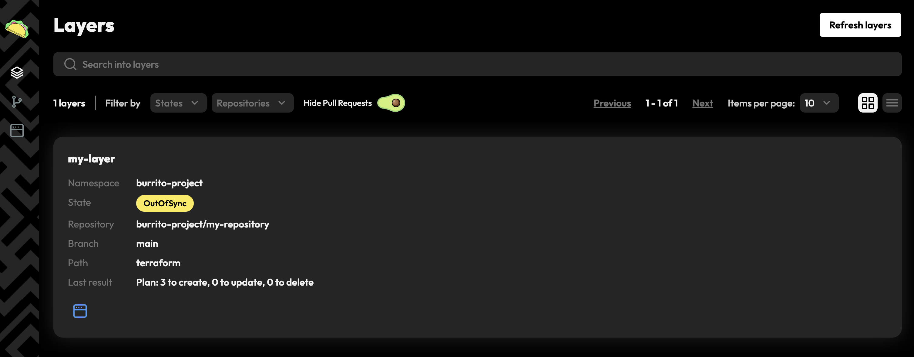

# Burrito Drift Detection

Drift detection is the core feature of Burrito. It allows you to monitor the drift between your Terraform state and your infrastructure in real-time.
Burrito continuously plans your Terraform code by launching runner pods that will download the Terraform code, plan it, and store the result in its datastore.

## Exercise

Follow the steps below to set up Burrito on a local cluster and start planning your Terraform code automatically.

### Requirements

- A Kubernetes cluster (you can use [kind](https://kind.sigs.k8s.io/docs/user/quick-start/) for a local cluster)
- [Helm](https://helm.sh/docs/intro/install/) CLI
- [kubectl](https://kubernetes.io/docs/tasks/tools/install-kubectl/) CLI

### Install Burrito

Install Burrito with Helm as described in the [installation guide](../installation/with-helm.md), using the provided values file.

```bash
helm upgrade --install burrito oci://ghcr.io/padok-team/charts/burrito -n burrito-system -f https://raw.githubusercontent.com/padok-team/burrito/main/docs/examples/values-simple.yaml
```

With this command, you installed burrito with the following configuration:

```yaml
config:
  burrito:
    controller:
      timers:
        driftDetection: 10m # run drift detection every 10 minutes
        onError: 10s # wait 10 seconds before retrying on error
        waitAction: 1m # wait 1 minute before retrying on locked layer
        failureGracePeriod: 30s # set a grace period of 30 seconds before retrying on failure (increases exponentially with the amount of failed retries)
    datastore:
      storage:
        mock: true # use a mock storage for the datastore (useful for testing, not recommended for production)
tenants:
  - namespace:
      create: true
      name: "burrito-project"
```

Burrito should be up and running in the `burrito-system` namespace.

```bash
kubectl get pods -n burrito-system
```

Output:
```
NAME                                   READY   STATUS    RESTARTS   AGE
burrito-controllers-6945797c5d-kjfl2   1/1     Running   0          2m00s
burrito-datastore-94d999f54-kbg9z      1/1     Running   0          2m00s
burrito-server-764f75766b-qw5nx        1/1     Running   0          2m00s
```

### Connect Burrito to Terraform code on GitHub

You will use the [example Terraform code](https://github.com/padok-team/burrito-examples) that we have prepared for you.
This repository contains simple Terraform and Terragrunt with local random-pets resources that you can use to test Burrito.

Create a TerraformRepository resource in the `burrito-system` namespace:

```bash
kubectl apply -f https://raw.githubusercontent.com/padok-team/burrito/main/docs/examples/terraform-repository.yaml
```

Here is the content of the `TerraformRepository` resource that you have created. It references the GitHub repository containing the Terraform code.
It also specifies that the IaC is Terraform code (as opposed to OpenTofu code). This setting will propagate to all layers linked to this repository by default, but can be overridden at the layer level.

```yaml
apiVersion: config.terraform.padok.cloud/v1alpha1
kind: TerraformRepository
metadata:
  name: my-repository
  namespace: burrito-project
spec:
  repository:
    url: https://github.com/padok-team/burrito-examples
  terraform:
    enabled: true
```

Create a `TerraformLayer` resource in the `burrito-system` namespace, referencing the `TerraformRepository` you just created. For now, the `autoApply` is set to false, so the layer will only plan the Terraform code and not apply it. 

```bash
kubectl apply -f https://raw.githubusercontent.com/padok-team/burrito/main/docs/examples/terraform-layer.yaml
```

```yaml
apiVersion: config.terraform.padok.cloud/v1alpha1
kind: TerraformLayer
metadata:
  name: my-layer
  namespace: burrito-project
spec:
  branch: main
  path: terraform
  remediationStrategy:
    autoApply: false
  repository:
    name: my-repository
    namespace: burrito-project
```

Check that your Terraform code is being planned by Burrito:

```bash
kubectl get pods -n burrito-project
```

Output:

```bash
NAME                   READY   STATUS      RESTARTS   AGE
my-layer-apply-xntrg   0/1     Completed   0          82s
```

The `TerraformLayer` should have been updated with the result of the plan. You can check the status of the `TerraformLayer` directly by querying the `TerraformLayer` resource, or by checking the burrito UI.

```bash
kubectl get tfl -n burrito-project
```

Output:

```bash
NAME       STATE         REPOSITORY      BRANCH   PATH        LAST RESULT
my-layer   ApplyNeeded   my-repository   main     terraform   Plan: 3 to create, 0 to update, 0 to delete
```

```bash
kubectl port-forward svc/burrito-server -n burrito-system 8080:80
```



Activate the `autoApply` feature by updating the `TerraformLayer` resource:

```bash
kubectl patch tfl my-layer -n burrito-project --type merge --patch '{"spec":{"remediationStrategy":{"autoApply":true}}}'
```

Check that the Terraform code was applied:

```bash
kubectl get pods -n burrito-project
```

Output:

```bash
NAME                   READY   STATUS      RESTARTS   AGE
my-layer-apply-bxlcr   0/1     Completed   0          54s
my-layer-plan-jv86k    0/1     Completed   0          7m22s
```

```bash
kubectl get tfl -n burrito-project
```

Output:

```bash
NAME       STATE   REPOSITORY      BRANCH   PATH        LAST RESULT
my-layer   Idle    my-repository   main     terraform   Apply Successful
```

### Conclusion

You have successfully set up Burrito on a local cluster and planned your Terraform code automatically. You can now monitor the drift between your Terraform state and your infrastructure in real-time.

## Next steps

- Learn how to [configure a PR/MR workflow](../pr-mr-workflow.md)
