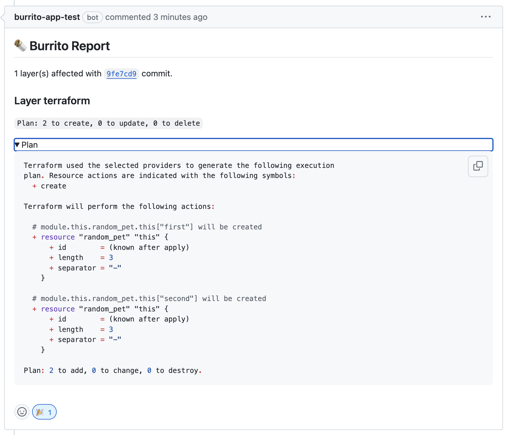

# PR/MR workflow

Now that you have set up Burrito and planned your Terraform code automatically, you can configure a PR/MR workflow to never have to use the `terraform apply` command ever again.

## Pre-requisites

- You have set up Burrito on a cluster.
- You set up TerraformRepository and TerraformLayer resources to plan your Terraform code automatically.

### Setup a webhook and GitHub app for your repository

To trigger the Burrito plan and apply workflow, you need to set up a webhook from your repository to your Burrito instance.
Fork the [burrito-examples](https://github.com/padok-team/burrito-examples) repository and update the `TerraformRepository` resource to point to your forked repository.

```yaml
apiVersion: config.terraform.padok.cloud/v1alpha1
kind: TerraformRepository
metadata:
  name: my-repository
  namespace: burrito-project
spec:
  repository:
    url: https://github.com/<your-github-handle>/burrito-examples
  terraform:
    enabled: true
```

You will also need to setup a [GitHub App](https://docs.github.com/en/apps/creating-github-apps/about-creating-github-apps/about-creating-github-apps) to allow Burrito to comment on your PRs/MRs. Follow the instructions in the [PR/MR workflow](../operator-manual/pr-mr-workflow.md#configuration) section of the operator manual to set up the GitHub app.
Make sure that you updated the Burrito values file to include the GitHub app ID, installation ID, and private key to the Burrito controller deployment.

!!! info
    Your controller deployment should now have the following environment variables:  
    - `BURRITO_CONTROLLER_GITHUBCONFIG_APPID`: The App ID of your GitHub app.  
    - `BURRITO_CONTROLLER_GITHUBCONFIG_INSTALLATIONID`: The Installation ID of your GitHub app.  
    - `BURRITO_CONTROLLER_GITHUBCONFIG_PRIVATEKEY`: The private key of your GitHub app.  

!!! note
    You can also use a personal access token instead of a GitHub app. Your GitHub account will be used to comment on the PRs/MRs.
    The environment variable to set is `BURRITO_CONTROLLER_GITHUBCONFIG_APITOKEN`

Now let's configure the GitHub webhook. Expose the `burrito-server` kubernetes service to the internet using the method of your choice. (for testing purposes on a local cluster, you can use `kubectl port-forward` and [ngrok](https://ngrok.com/) to expose the service to the internet).

Configure a webhook in your GitHub repository to point to the exposed `burrito-server` service. **Make sure to specify the `/api/webhook` path in the target url.** The webhook should be triggered on `push` and `pull_request` events. You can reference your webhook secret in a secret named `burrito-webhook-secret` in the controller namespace (`burrito-system` in this tutorial).

```yaml
kind: Secret
metadata:
  name: burrito-webhook-secret
  namespace: burrito-system
type: Opaque
stringData:
  burrito-webhook-secret: <my-webhook-secret>
```

You can also directly add the webhook secret as an environment variable of the `burrito-server` deployment. The variable name depends on your git provider. For GitHub, the environment variable is `BURRITO_SERVER_WEBHOOK_GITHUB_SECRET`.

### Experiment with the PR/MR workflow

Now that you have set up the webhook and GitHub app, you can experiment with the PR/MR workflow.
Create a new branch in your forked repository and make some changes to the Terraform code. Push the changes to the branch and open a PR/MR against the main branch.

A new TerraformPullRequest resource should be created in your tenant namespace. You can check the status of the resource by running:

```bash
kubectl get pr -n burrito-project
```

Output:

```bash
NAME              ID    STATE   PROVIDER   BASE   BRANCH
my-repository-1   1     Idle    github     main   update-tf-code
```

A new TerraformLayer resource should also be created to plan the Terraform code. You can check the status of the resource by running:

```bash
kubectl get tfl -n burrito-project
```

Output:

```bash
NAME                  STATE         REPOSITORY      BRANCH           PATH        LAST RESULT
my-layer              ApplyNeeded   my-repository   main             terraform   Plan: 3 to create, 0 to update, 0 to delete
my-layer-pr-1-rxvrt   ApplyNeeded   my-repository   update-tf-code   terraform   Plan: 2 to create, 0 to update, 0 to delete
```

The Burrito server should have commented on the PR/MR with the plan output. You can check the comments on the PR/MR to see the plan output.



Set the `autoApply` field to `true` in the TerraformLayer resource to automatically apply the Terraform code upon merging the PR/MR.

### Conclusion

You have now set up a PR/MR workflow with Burrito to automatically plan and apply your Terraform code. You can now focus on writing Terraform code and let Burrito handle the rest.

### Next steps

- [Navigate the Burrito UI](../guides/ui.md) to see the status of the Terraform resources.
