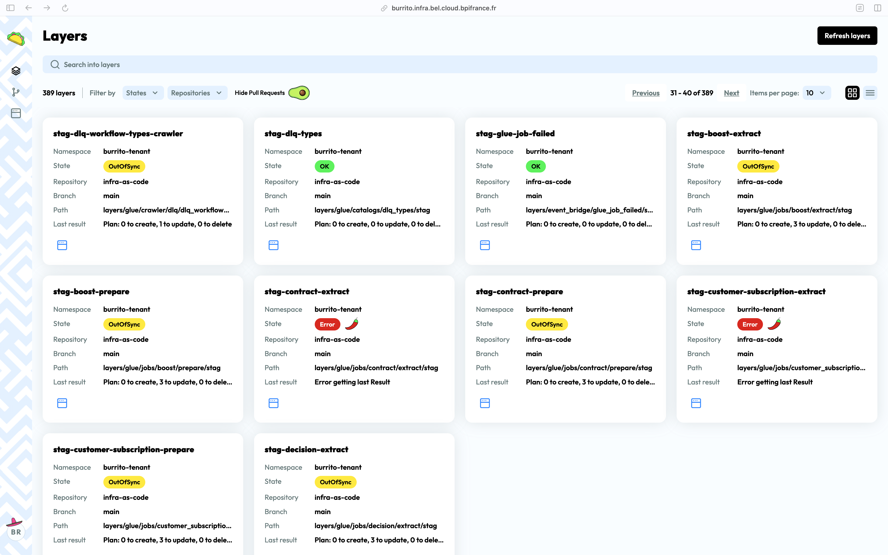
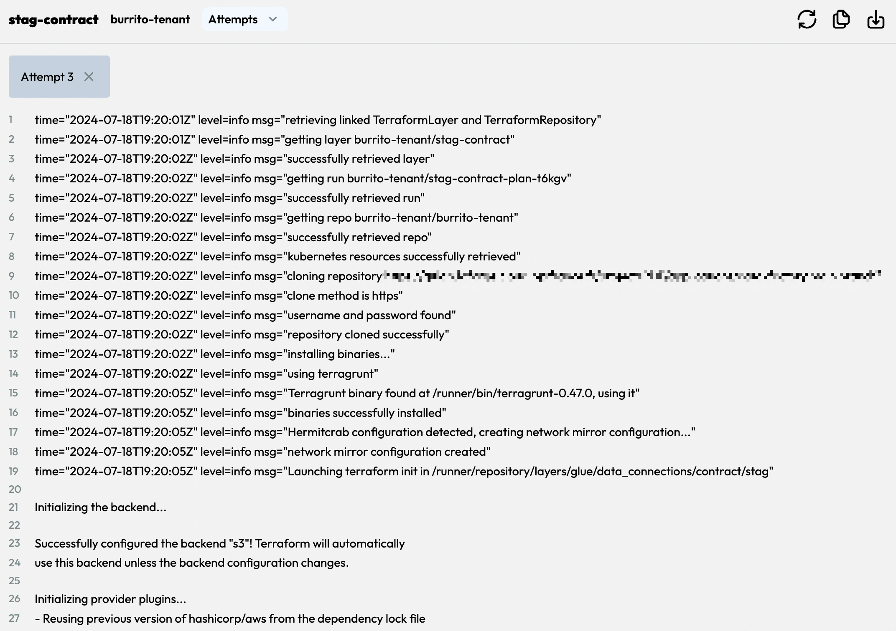

# UI Overview

The Burrito UI is a web-based interface that allows you to view the state of your Terraform layers and resources, as well as the drift between the desired and actual state of your infrastructure.

## Pre-requisites

- A running Burrito installation

## Accessing the UI

The Burrito UI is accessible via a web browser. To access the UI, you need to expose the `burrito-server` service locally or on a public URL.

## Features

### Homepage

The homepage displays a list of all the Terraform layers that have been added to Burrito. Each layer is displayed as a card with the following information:

- Namespace
- Repository
- Branch
- Code path
- Last plan result
- State (Error, Out-of-sync, OK)

### Terraform / Terragrunt logs

Click on the layer card to view the Terraform or Terragrunt logs for that layer. You can explore previous runs and view the logs for each run. The maximum number of logs to keep is configurable.

A dedicated page for exploring the logs is also available.

### More to come

Burrito is under active development, and we are working on adding more features to the UI such as:

- "Plan and apply" buttons
- Notifications
- User management
- Pull request view
  ... and more!
