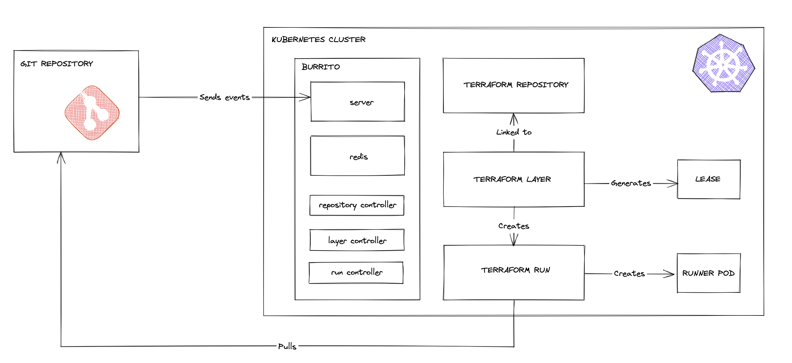

# Architectural Overview

## Components

### The server

The server is a REST server which exposes the API consumed by the Web UI. It has the following responsibilities:

- listener for Git webhook events

Other features will be implemented when the Web UI will be in development.

### The Repository Controller

The repository controller is a Kubernetes Controller that manages `TerraformRepository` resources. It has the following responsibilities:

- Fetching Git repository information and authentication
- Retrieving branch metadata and latest commits (revisions)
- Creating Git bundles for efficient code distribution
- Storing bundles in the datastore for runner access
- Tracking the synchronization state of repositories
- Managing the lifecycle of TerraformRepository resources

### The Layer Controller

The layer controller is a Kubernetes Controller which continuously monitors declared `TerraformLayer` resources.
It regurlarly creates `TerraformRun` resources which run a `terraform plan` for each of your layer to check if a drift has been introduced.
If so, it has the possibility to create a `TerraformRun` that does a `terraform apply`.

It is also responsible for running your Terraform `plan` and `apply` if there is a new commit on your layer.

### The Run Controller

The run controller is a Kubernetes Controller which continuously monitors declared `TerraformRun` resources.

It is responsible for running the `terraform plan` and `terraform apply` commands by creating runner pods. It handles failure and retries of the runner pods.

It also generates [`Leases`](https://kubernetes.io/docs/concepts/architecture/leases/) to make sure no concurrent terraform commands will be launched on the same layer at the same time.

### The Datastore instance

The Datastore instance of Burrito is an HTTP proxy that provides download/upload capabilities to the runners. It is used to store:

- the Terraform plan files generated by the runners
- the runner logs (for visualization in the Web UI)
- the Git bundles created by the repository controller (used by the runners to access the code of the layers)

## Implementation

The operator has been bootstrapped using the [`operator-sdk`](https://sdk.operatorframework.io/).

The CLI used to start the different components is implemented using [`cobra`](https://github.com/spf13/cobra).

### The TerraformRepository Controller

For more details on how the repository controller works with Git bundles and revisions, see the [Repository Controller documentation](./repository-controller.md).

### Controller state machines

Each controller drives its resource through a state machine whose status is
expressed using the [conditions standards defined by the community](https://github.com/kubernetes/community/blob/master/contributors/devel/sig-architecture/api-conventions.md#typical-status-properties).
For the full state machines of each CRD, the conditions that drive them, and how
the resources interact, see [CRD State Machines](./state-machines.md).

The `TerraformRun` controller also creates and deletes the [Kubernetes leases](https://kubernetes.io/docs/concepts/architecture/leases/) to avoid concurrent use of Terraform on the same layer.

### The runners

The runner implementation relies on [`tenv`](https://github.com/tofuutils/tenv), a tool from the community which allows us to dynamically download and use any version of Terraform, Terragrunt or OpenTofu (coming soon). Thus, we support any existing version of Terraform.

If no version constraint is set in the TerraformLayer resource or in the TerraformRepository resource, `tenv` will detect which version of Terraform/Terragrunt/OpenTofu to use by looking at the version constraints in your code.

The runner is responsible to update the annotations of the layer it is associated to to store information about what commit was planned/applied and when.
