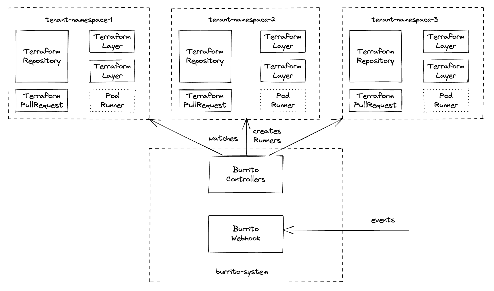

# Multi-tenant architecture

<p align="center"></p>

With our [Helm chart](./install/with-helm.md) we provide a way to setup multi-tenancy with burrito. This is useful when working at scale, when you controls multiple Terraform projects with burrito across several teams.

The setup is split across multiple Kubernetes namespaces:

- `burrito-system` is where burrito's components live and operate (controllers, server, datastore)
- the other namespaces (`tenant-namespace-[1-3]` on the schema) where `TerraformRepository`, `TerraformLayer`, `TerraformRun` and `TerraformPullRequest` resources live and where burrito spawns runner pods for Terraform `plan` and `apply` actions.

Thanks to Kubernetes native RBAC system you can restrict access for your users only to the namespaces their burrito resources live.

## Configuring multi-tenancy with the Helm chart

### 1. Configure basic tenants

In the `values.yaml` of the [Helm chart](./install/with-helm.md), add the following:

```yaml
tenants:
  - namespace:
      create: true
      name: tenant-namespace-1
    serviceAccounts:
      - name: runner-project
  - namespace:
      create: true
      name: tenant-namespace-2
    serviceAccounts:
      - name: runner-project
  - namespace:
      create: true
      name: tenant-namespace-3
    serviceAccounts:
      - name: runner-project
```

This setup creates 3 tenants with 3 namespaces with one service account in each namespace.

The chart adds every tenant referenced in its values in the namespaces that the burrito controllers must watch.

You can also customize namespaces' labels and annotations:

```yaml
tenants:
  - namespace:
      create: true
      name: tenant-namespace-1
      labels:
        app.kubernetes.io/part-of: project-1
      annotations:
        helm.sh/resource-policy: keep
```

### 2. Configure service accounts

Each service account created in a tenant is bound to the `burrito-runner` ClusterRole, it is a basic role with the required permissions for a burrito runner pod to work properly.

You can add additional role bindings to the service accounts if you need special permissions in the cluster (e.g. a Terraform layer deploying to Kubernetes) as well as annotations and labels (e.g. assume a role on a cloud provider).

```yaml
  - namespace:
      create: true
      name: tenant-namespace-1
    serviceAccounts:
      - name: runner-kubernetes
        additionalRoleBindings:
          - name: custom
            role:
              kind: ClusterRole
              name: custom-role
      - name: runner-google
        labels:
          app.kubernetes.io/part-of: project-1
        annotations:
          iam.gke.io/gcp-service-account: burrito-project-1@company-project.iam.gserviceaccount.com
      - name: runner-aws
        annotations:
          eks.amazonaws.com/role-arn: arn:aws:iam::111122223333:role/my-role
```

### 3. Use service accounts in the tenant

For the `TerraformRepository` or `TerraformLayer` you deploy in a tenant, you can use the `overrideRunnerSpec` parameter to select which service account to use for runners affected to a layer/repository.

```yaml
apiVersion: config.terraform.padok.cloud/v1alpha1
kind: TerraformLayer
metadata:
  name: infra-aws
  namespace: tenant-namespace-1
spec:
  terraform:
    version: "1.5.3"
  path: "infra/layers/aws/production"
  branch: "main"
  repository:
    name: project-1
    namespace: tenant-namespace-1
  overrideRunnerSpec:
    serviceAccountName: runner-aws # <-- Specify service account here
```
