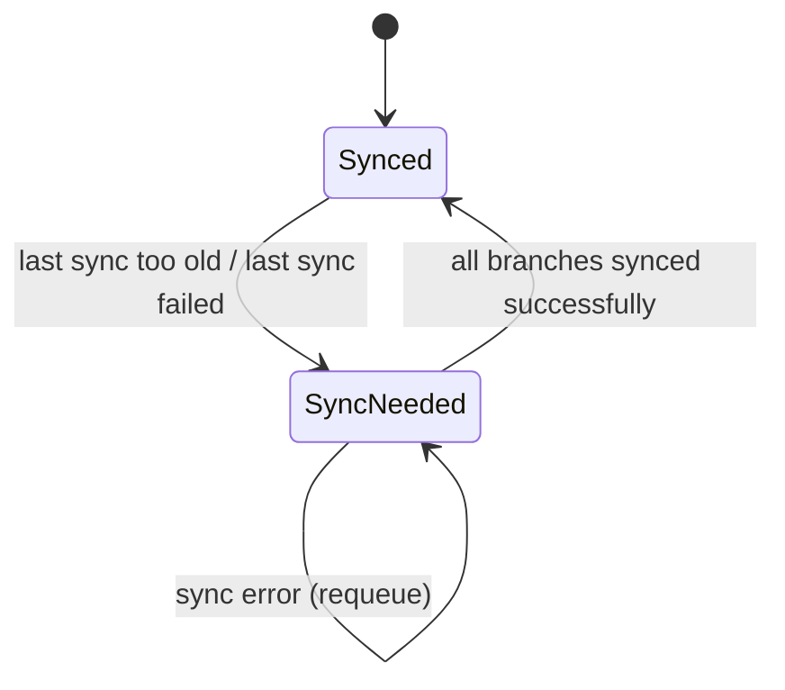
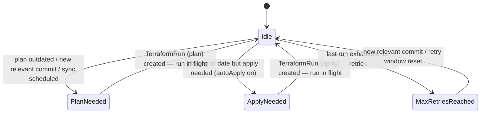
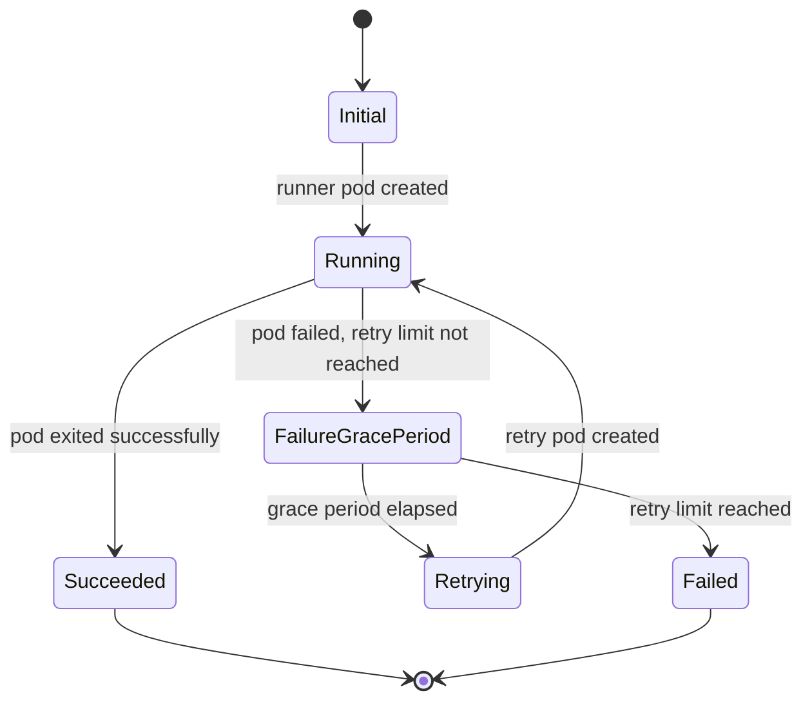
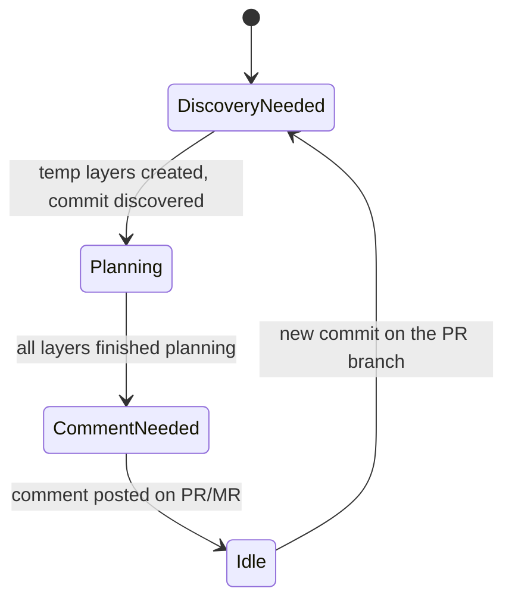
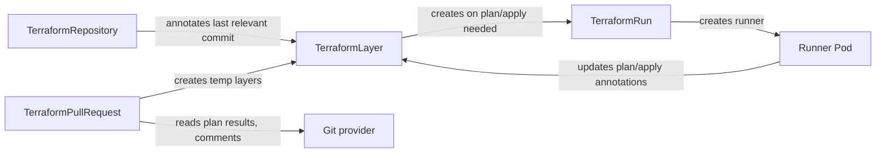

# CRD State Machines

Each Burrito custom resource is driven by a state machine implemented in its
reconciler (`internal/controllers/<crd>/states.go`). Burrito controllers are
**level-based**: on every reconcile the controller *recomputes* the current state
from a set of boolean conditions through an ordered `switch`. There are no stored
transitions — a state's handler performs a side-effect (creating a `TerraformRun`,
a runner pod, an annotation…), and the *next* reconcile observes the changed
conditions and yields the next state.

A practical consequence: some states are **transient triggers**. For example a
`TerraformLayer` in `PlanNeeded` creates a run and, on the following reconcile,
is seen as running and reported as `Idle` again.

## TerraformRepository

The repository controller keeps Git bundles in the datastore in sync with the
remote. It has two states, decided by whether the last sync is too old or failed.

- `Synced` — bundles are up to date; requeue at the repository sync interval.
- `SyncNeeded` — fetch latest revisions per branch, store bundles, and annotate
  the affected layers.

## TerraformLayer

The layer controller watches declared layers and creates `TerraformRun` resources
to plan (drift detection) and, when auto-apply is enabled, to apply. The state is
computed from conditions such as *is a run in flight*, *is a sync scheduled*, *is
the last plan too old*, *is the last relevant commit planned*, *is the apply up to
date*, and *has the last run reached its retry limit*.

Because the first `switch` case is "a run is in flight → `Idle`", a layer with a
running plan/apply is reported as `Idle`. `PlanNeeded` and `ApplyNeeded` are
transient: their handler creates the run and the next reconcile returns to `Idle`.

- `Idle` — nothing to do; requeue at the drift-detection interval.
- `PlanNeeded` — create a plan `TerraformRun`.
- `ApplyNeeded` — create an apply `TerraformRun` (only if auto-apply is enabled).
- `MaxRetriesReached` — the last run exhausted its retries; manual intervention
  needed.

## TerraformRun

The run controller executes a plan or apply by creating runner pods, and handles
retries with an exponential backoff grace period. `Succeeded` and `Failed` are
terminal.

- `Initial` — freshly created; sets the lease and launches the first runner pod.
- `Running` — a runner pod is currently running.
- `FailureGracePeriod` — the runner failed; wait (exponential backoff) before retry.
- `Retrying` — grace period elapsed and retry limit not reached; launch a new pod.
- `Succeeded` — the runner pod exited successfully (lease released).
- `Failed` — retries exhausted (lease released).

## TerraformPullRequest

The pull-request controller discovers layers affected by a PR/MR, waits for their
plans, and posts a comment. Note that "comment up to date" is checked before
"layers still planning", so a PR with an up-to-date comment is reported as `Idle`.

- `DiscoveryNeeded` — a new commit was detected; (re)create the temporary layers
  affected by the PR.
- `Planning` — the temporary layers are still planning.
- `CommentNeeded` — plans finished; post/update the PR comment.
- `Idle` — comment is up to date; nothing to do.

## How the CRDs interact

The resources form a chain: the repository annotates layers with the latest
relevant commit, layers create runs, runs create runner pods, and pods write plan
and apply results back onto the layer's annotations. A pull request creates
temporary layers and reports their plan results as a comment.

