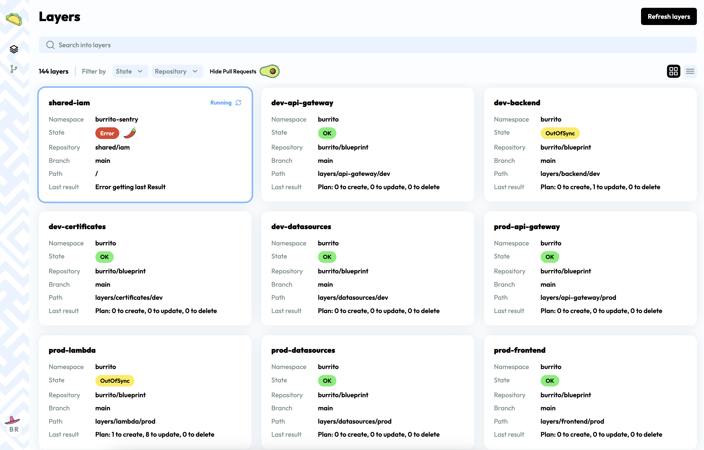

# Overview

## What is Burrito?

**Burrito** is a TACoS (**T**erraform **A**utomation **Co**llaboration **S**oftware) Kubernetes Operator.

Burrito is designed to help you manage and automate your infrastructure as code in a Kubernetes-native way. In simple terms, it aims at being the _[ArgoCD](https://argoproj.github.io/cd/) for Infrastructure as Code_.

## Why Burrito?

[`terraform`](https://www.terraform.io/) is a tremendous tool to manage your infrastructure in IaC.
However, it lacks built-in solutions for

- Managing [state drift](https://developer.hashicorp.com/terraform/tutorials/state/resource-drift).
- Continuous planning and applying of your Terraform code.
- Easy navigation of Terraform state.

### State Drift

Burrito provides a way to **continuously plan your Terraform code and apply it**. This way, you can ensure that your infrastructure is always up to date with your code, or at least be aware of the drift.
This is especially useful when you have multiple people working on the same Terraform codebase. Burrito will help you detect drifts and resolve them before they become a problem.

### Continuous Planning and Applying

Configuring a CI/CD pipeline for Terraform can be challenging because it often varies depending on the selected tools. Burrito offers an **out-of-the-box PR/MR integration**, so you don't have to write CI/CD pipelines for Terraform ever again. This ensures that you won't have to deal with:

- Managing state locks.
- Managing Terraform versions.
- Saving Terraform plan logs and results.
- Integrating auditing tools (like [Checkov](https://www.checkov.io/)).

When a PR/MR is opened, Burrito will automatically plan the Terraform code and comment on the MR/PR with the plan. This way, you can easily see the impact of the changes before applying them. Once the PR/MR is merged, Burrito will apply the Terraform code.

### Navigation of Your Terraform State

With its curated UI, Burrito provides a way to easily navigate your Terraform state, see the resources, and their dependencies. This way, you can easily see the impact of a change before applying it. [Not yet implemented]

## Compatibility

Burrito is compatible with:

- Terraform.
- Terragrunt.
- OpenTofu (coming soon).

## Getting Started

- Follow the [getting started section](./getting-started.md) to quickly set up Burrito and start monitoring Terraform state drift.
- Follow the [guides](./guides/index.md) for detailed tutorials on how to use Burrito.
- Deep dive into the [operator manual](./operator-manual/index.md) to set up advanced configurations and features.
- Use the [user guide](./user-guide/index.md) to learn how to configure Burrito resources according to your needs.
